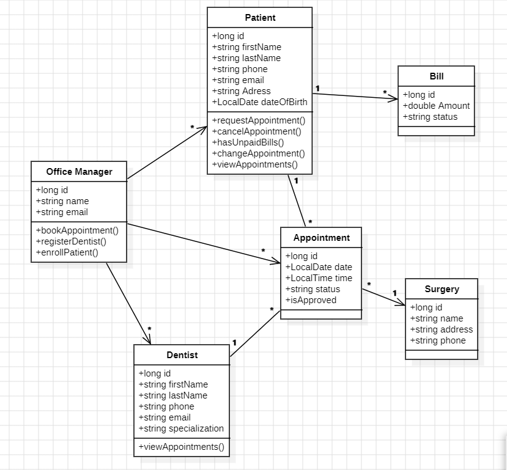
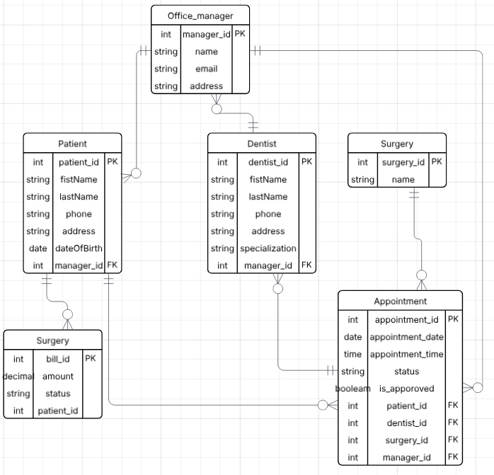

# Dental-surgery-system

Welcome to the **Dental Surgery System** project.  
This repository includes the software requirements and UML domain modeling for the **Advantis Dental Surgeries** project.

This app is designed to help Advantis Dental Surgeries (ADS) manage their operations efficiently, including dentist registration, patient appointment scheduling, billing, and appointment management.

---

## ✅ Functional Requirements

1. Office Managers can:
   - Register new dentists with ID, name, contact info, and specialization.
   - Register new patients with name, contact info, mailing address, and birthdate.
   - Schedule appointments upon request (call-in or online form).
   - Receive and process appointment cancellation/change requests.
   - Ensure patients with unpaid bills cannot schedule new appointments.

2. Dentists can:
   - Sign in to view all upcoming appointments.
   - View detailed patient info associated with each appointment.

3. Patients can:
   - Sign in to view their appointments and assigned dentist.
   - Request to cancel or modify upcoming appointments.

4. Appointment logic:
   - Each appointment is for a specific date and time at a surgery location.
   - A dentist cannot have more than **5 appointments in a single week**.

5. Surgery data includes:
   - Name, location, and contact number of each surgery.

---

## 🧠 Domain Model
Below is the domain model representing the core entities and relationships in the Advantis Dental Surgeries system:

---

## 🗃️ Entity Relationship Diagram
The following ER diagram represents the database design for the Advantis Dental Surgery (ADS) system. It outlines how patients, dentists, appointments, surgeries, office managers, and billing records are related within the system.

---

## 🛠 Technologies Used
- 📝 StarUML (for UML class diagram)
- 📂 GitHub for version control

